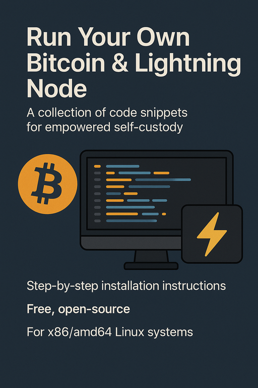

    

## A Collection of compilation snippets

This is a collection of code snippets for running your own Bitcoin and Lightning node at home, empowering you with full control over your financial sovereignty without relying on third-party services. The guide details step-by-step installation instructions focused on self-compiling binaries from trusted open-source GitHub repositories, ensuring transparency, security, and customization tailored to x86/amd64 hardware and an underlying Linux OS.